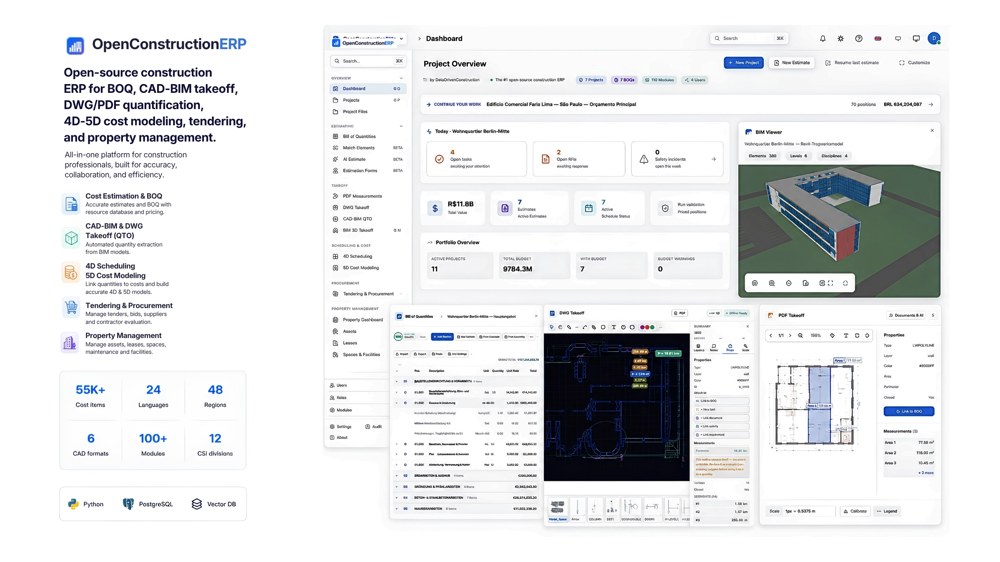
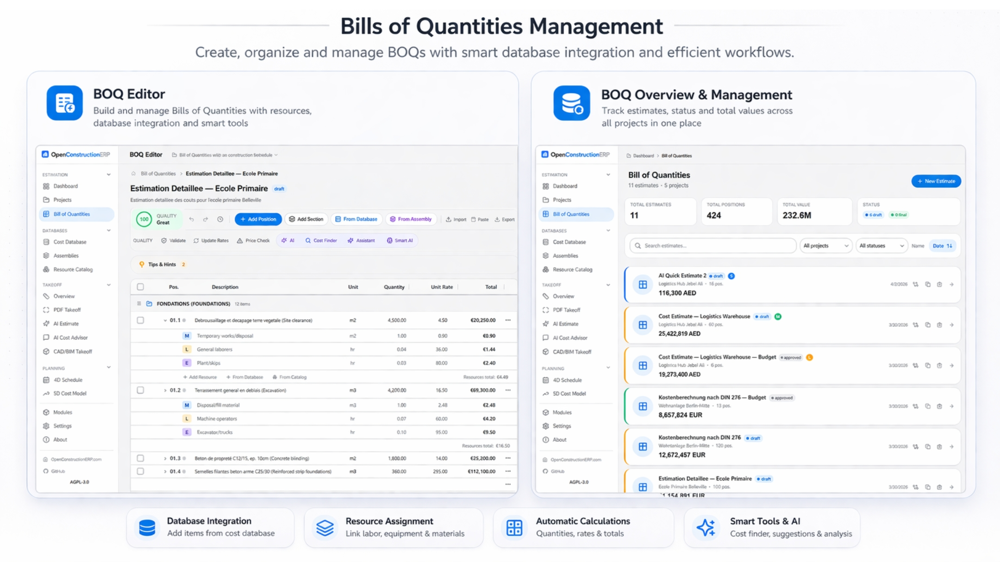
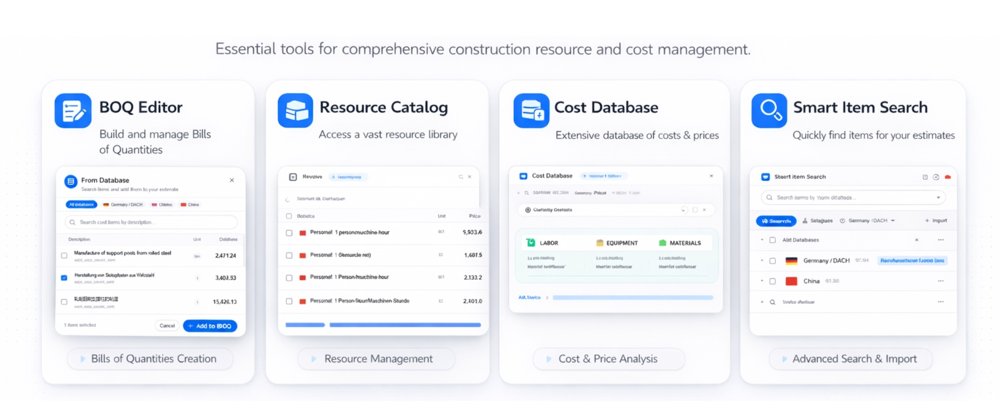

<div align="center">

# OpenConstructionERP

**The #1 Open-Source Construction Estimation & Project Management Software**

Professional BOQ, 4D/5D planning, AI-powered estimation, CAD/BIM takeoff — all in one platform.

[Demo](https://openconstructionerp.com) · [Documentation](https://openconstructionerp.com/docs) · [Discussions](https://t.me/datadrivenconstruction) · [Report Bug](https://github.com/datadrivenconstruction/OpenConstructionERP/issues)




*100% open source · 55,000+ cost items · AI estimation · 21 languages · Self-hosted*

</div>

---

## Why OpenConstructionERP?

Construction cost estimation software is expensive, closed-source, and locked to specific regions. OpenConstructionERP changes that.

| What you get | How it works |
|-------------|-------------|
| **Free forever** | AGPL-3.0 license. No subscriptions, no per-seat fees, no vendor lock-in. |
| **Your data, your server** | Self-hosted. Everything runs on your machine — nothing leaves your network. |
| **21 languages** | Full UI translation: English, German, French, Spanish, Portuguese, Russian, Chinese, Arabic, Hindi, Japanese, Korean, and 10 more. |
| **20 regional standards** | DIN 276, NRM 1/2, CSI MasterFormat, GAEB, ГЭСН, DPGF, GB/T 50500, CPWD, and more. |
| **AI-powered** | Connect any LLM provider (Anthropic, OpenAI, Gemini, Mistral, Groq, DeepSeek) for smart estimation. |
| **55,000+ cost items** | CWICR database with 11 regional pricing databases (DACH, UK, US, France, Spain, Brazil, Russia, UAE, China, India, Canada). |

### How It Compares

| Capability | OpenConstructionERP | RIB iTWO | Exactal CostX | Sage Estimating | Bluebeam |
|:-----------|:---:|:---:|:---:|:---:|:---:|
| **Open source** | ✅ | ❌ | ❌ | ❌ | ❌ |
| **Self-hosted / offline** | ✅ | ❌ | ❌ | ⚠️ | ❌ |
| **Price** | Free | ~€500/mo | ~€300/mo | ~€200/mo | ~€30/mo |
| **AI estimation** | ✅ 7 LLM providers | ❌ | ❌ | ❌ | ❌ |
| **Languages** | 21 | 5 | 3 | 2 | 8 |
| **Regional standards** | 20 | 4 | 3 | 2 | — |
| **BOQ editor** | ✅ | ✅ | ✅ | ✅ | ❌ |
| **CAD/BIM takeoff** | ✅ RVT IFC DWG DGN | ✅ | ✅ | ❌ | ✅ PDF only |
| **4D/5D planning** | ✅ | ✅ | ❌ | ❌ | ❌ |
| **Cost database included** | ✅ 55K+ work items with base rates | ❌ extra cost | ❌ extra cost | ❌ extra cost | ❌ |
| **Resource catalog** | ✅ 7K+ materials, labor, equipment with prices | ❌ extra cost | ❌ | ❌ | ❌ |
| **Validation engine** | ✅ 42 rules | ⚠️ limited | ❌ | ❌ | ❌ |
| **API access** | ✅ REST API | ⚠️ limited | ❌ | ❌ | ❌ |

---

### Complete Estimation Workflow

OpenConstructionERP covers the full lifecycle — from first sketch to final tender submission:

```
  Upload              Convert            Validate           Estimate           Tender
 ┌────────┐        ┌──────────┐       ┌───────────┐      ┌──────────┐      ┌──────────┐
 │PDF/CAD │───────▶│ Extract  │──────▶│ 42 rules  │─────▶│BOQ Editor│─────▶│ Bid Pkgs │
 │Photo   │        │quantities│       │ DIN/NRM/  │      │ + AI     │      │ Compare  │
 │Text    │        │ + AI     │       │ MasterFmt │      │ + Costs  │      │ Award    │
 └────────┘        └──────────┘       └───────────┘      └──────────┘      └──────────┘
                                                               │
                                                         ┌─────┴──────┐
                                                         │ 4D Schedule│
                                                         │ 5D Costs   │
                                                         │ Risk Reg.  │
                                                         │ Reports    │
                                                         └────────────┘
```

---

⭐ <b>If you want to see new updates and database versions and if you find our tools useful please give our repositories a star to see more similar applications for the construction industry.</b>
Star OpenConstructionERP on GitHub and be instantly notified of new releases.
<p align="center">
  <br>
  
  <br></br>
</p>

---

## Key Features

### 📊 Bill of Quantities (BOQ) Management



Build professional cost estimates with a powerful BOQ editor:

- **Hierarchical BOQ structure** — Sections, positions, sub-positions with drag-and-drop reordering
- **Inline editing** — Click any cell to edit. Tab between fields. Undo/redo with Ctrl+Z
- **Resources & assemblies** — Link labor, materials, equipment to each position. Build reusable cost recipes
- **Markups** — Overhead, profit, VAT, contingency — configure per project or use regional defaults
- **Automatic calculations** — Quantity × unit rate = total. Section subtotals. Grand total with markups
- **Validation** — 42 built-in rules check for missing quantities, zero prices, duplicate items, and compliance with DIN 276, NRM, MasterFormat
- **Export** — Download as Excel, CSV, PDF report, or GAEB XML (X83)

### 🗄️ Cost Databases & Resource Catalog



Access the world's construction pricing data:

- **CWICR database** — 55,000+ cost items covering all major construction trades. Available in 9 languages with 11 regional price sets
- **Smart search** — Find items by description, code, or classification. AI-powered semantic search matches meaning, not just keywords ("concrete wall" finds "reinforced partition C30/37")
- **Resource catalog** — 7,000+ materials, equipment, labor rates, and operators. Build custom assemblies from catalog items
- **Regional pricing** — Automatic price adjustment based on project location. Compare rates across regions
- **Import your data** — Upload your own cost database from Excel, CSV, or connect via API

### 🏗️ CAD/BIM Takeoff & AI Estimation


Extract quantities from any source — drawings, models, text, or photos:

- **CAD/BIM takeoff** — Upload Revit (.rvt), IFC, AutoCAD (.dwg), or MicroStation (.dgn) files. DDC converters extract elements with volumes, areas, and lengths automatically
- **Interactive QTO** — Choose how to group extracted data: by Category, Type, Level, Family. Format-specific presets for Revit and IFC
- **PDF measurement** — Open construction drawings directly in the browser. Measure distances, areas, and count elements with calibrated scale
- **AI estimation** — Describe your project in plain text, upload a building photo, or paste a PDF — AI generates a complete BOQ with quantities and market rates
- **AI Cost Advisor** — Ask questions about pricing, materials, or estimation methodology. AI answers using your cost database as context
- **Cost matching** — After AI generates an estimate, match each item against your CWICR database to replace AI-guessed rates with real market prices

### 📅 4D Scheduling & 5D Cost Model

Plan your project timeline and track costs over time:

- **Gantt chart** — Visual project schedule with drag-and-drop activities, dependencies (FS/FF/SS/SF), and critical path highlighting
- **Auto-generate from BOQ** — Create schedule activities directly from your BOQ sections with cost-proportional durations
- **Earned Value Management** — Track SPI, CPI, EAC, and variance. S-curve visualization shows planned vs actual progress
- **Budget tracking** — Set baselines, compare snapshots, run what-if scenarios
- **Monte Carlo simulation** — Risk-adjusted schedule analysis with probability distributions

### 📋 Tendering, Risk & Reporting

Complete your estimation workflow:

- **Tendering** — Create bid packages, distribute to subcontractors, collect and compare bids with side-by-side price mirror
- **Change orders** — Track scope changes with cost and schedule impact analysis
- **Risk register** — Probability × impact matrix, mitigation strategies, risk-adjusted contingency
- **Reports** — Generate professional PDF reports, Excel exports, GAEB XML. 12 built-in templates
- **Documents** — Centralized file management with version tracking and drag-and-drop upload

### 🌍 20 Regional Standards

| Standard | Region | Format |
|----------|--------|--------|
| DIN 276 / ÖNORM / SIA | Germany / Austria / Switzerland | Excel, CSV |
| NRM 1/2 (RICS) | United Kingdom | Excel, CSV |
| CSI MasterFormat | United States / Canada | Excel, CSV |
| GAEB DA XML 3.3 | DACH region | XML |
| DPGF / DQE | France | Excel, CSV |
| ГЭСН / ФЕР | Russia / CIS | Excel, CSV |
| GB/T 50500 | China | Excel, CSV |
| CPWD / IS 1200 | India | Excel, CSV |
| Bayındırlık Birim Fiyat | Turkey | Excel, CSV |
| 積算基準 (Sekisan) | Japan | Excel, CSV |
| Computo Metrico / DEI | Italy | Excel, CSV |
| STABU / RAW | Netherlands | Excel, CSV |
| KNR / KNNR | Poland | Excel, CSV |
| 표준품셈 | South Korea | Excel, CSV |
| NS 3420 / AMA | Nordic countries | Excel, CSV |
| ÚRS / TSKP | Czech Republic / Slovakia | Excel, CSV |
| ACMM / ANZSMM | Australia / New Zealand | Excel, CSV |
| CSI / CIQS | Canada | Excel, CSV |
| FIDIC | UAE / GCC | Excel, CSV |
| PBC / Base de Precios | Spain | Excel, CSV |

### 🛡️ Validation & Compliance Engine

Ensure your estimates meet regulatory standards before submission:

- **42 built-in rules** across 13 rule sets — DIN 276, NRM, MasterFormat, GAEB, and universal BOQ quality checks
- **Real-time validation** — Run checks with Ctrl+Shift+V. Each position gets a pass/warning/error indicator
- **Quality score** — Overall BOQ quality percentage (0–100%) visible in the toolbar
- **Drill-down** — Click any finding to jump directly to the affected BOQ position and fix it
- **Custom rules** — Define project-specific validation rules via the rule builder or Python scripting

### 🚀 Guided Onboarding

Get productive in under 10 minutes:

1. **Choose language** — Select from 21 languages. The entire UI switches instantly
2. **Select region** — Determines default cost database, currency, and classification standard
3. **Load cost database** — One-click import of CWICR pricing data for your region (55,000+ items)
4. **Import resource catalog** — Materials, labor, equipment, and pre-built assemblies
5. **Configure AI** *(optional)* — Enter an API key from any supported LLM provider
6. **Create your first project** — Set name, region, standard, and start estimating

---

## Quick Start

### Fastest: One-Line Install

```bash
# Linux / macOS
curl -sSL https://raw.githubusercontent.com/datadrivenconstruction/OpenConstructionERP/main/scripts/install.sh | bash

# Windows (PowerShell)
irm https://raw.githubusercontent.com/datadrivenconstruction/OpenConstructionERP/main/scripts/install.ps1 | iex
```

Auto-detects Docker / Python / uv → installs and runs at **http://localhost:8080**

### Option 1: Docker (recommended)

```bash
git clone https://github.com/datadrivenconstruction/OpenConstructionERP.git
cd OpenConstructionERP
make quickstart
```

Open **http://localhost:8080** — builds everything in ~2 minutes.

### Option 2: Local Development (no Docker)

```bash
git clone https://github.com/datadrivenconstruction/OpenConstructionERP.git
cd OpenConstructionERP

# Install dependencies
cd backend && pip install -r requirements.txt && cd ..
cd frontend && npm install && cd ..

# Start (Linux/macOS)
make dev

# Start (Windows — two terminals)
# Terminal 1: cd backend && uvicorn app.main:create_app --factory --reload --port 8000
# Terminal 2: cd frontend && npm run dev
```

Open **http://localhost:5173** — requires Python 3.12+ and Node.js 20+. Uses SQLite by default — zero configuration needed.

### Option 3: pip install (standalone)

```bash
pip install -e ./backend
openconstructionerp serve --open
```

### Demo Accounts

Three demo accounts are created automatically on first start:

| Account | Email | Password | Role |
|---------|-------|----------|------|
| Admin | `demo@openestimator.io` | `DemoPass1234!` | Full access |
| Estimator | `estimator@openestimator.io` | `DemoPass1234!` | Estimator |
| Manager | `manager@openestimator.io` | `DemoPass1234!` | Manager |

> Demo accounts include 5 pre-loaded projects from Berlin, London, New York, Paris, and Dubai with complete BOQs, schedules, and cost models.

---

## Tech Stack

| Layer | Technology | Purpose |
|-------|-----------|---------|
| Backend | Python 3.12+ / FastAPI | Async API, Pydantic v2 validation, modular architecture |
| Frontend | React 18 / TypeScript / Vite | SPA with code splitting, 21 language bundles |
| Database | PostgreSQL 16+ / SQLite (dev) | OLTP with JSON columns, zero-config SQLite for development |
| UI | Tailwind CSS / AG Grid | Professional data grid, responsive design, dark mode |
| AI | Any LLM via REST API | Anthropic, OpenAI, Gemini, Mistral, Groq, DeepSeek |
| Vector Search | LanceDB (embedded) / Qdrant | Semantic cost item search, 384d or 3072d embeddings |
| CAD/BIM | [DDC cad2data](https://github.com/datadrivenconstruction) | RVT, IFC, DWG, DGN → structured quantities |
| i18n | i18next + 21 language packs | Full RTL support (Arabic), locale-aware formatting |

## Architecture

```
┌──────────────────────────────────────────────────┐
│  Frontend (React SPA)                            │
│  TypeScript · Tailwind · AG Grid · PDF.js        │
└──────────────────┬───────────────────────────────┘
                   │ REST API
┌──────────────────┴───────────────────────────────┐
│  Backend (FastAPI)                               │
│  17 auto-discovered modules · Plugin system      │
├──────────────────────────────────────────────────┤
│  BOQ · Costs · Schedule · 5D · Validation · AI  │
│  Takeoff · Tendering · Risk · Reports · Catalog  │
├──────────────────────────────────────────────────┤
│  Database (PostgreSQL / SQLite)                  │
│  Vector DB (LanceDB / Qdrant)                    │
│  CAD Converters (DDC cad2data)                   │
└──────────────────────────────────────────────────┘
```

---

## Support the Project

OpenConstructionERP is built and maintained by the community. If you find it useful:

- ⭐ **[Star this repo](https://github.com/datadrivenconstruction/OpenConstructionERP)** — helps others discover the project
- 💬 **[Join Discussions](https://t.me/datadrivenconstruction)** — ask questions, share ideas, help others
- 🐛 **[Report issues](https://github.com/datadrivenconstruction/OpenConstructionERP/issues)** — help us improve
- 💼 **[Professional consulting](https://datadrivenconstruction.io/contact-support/)** — custom deployment, training, enterprise support

## Security

OpenConstructionERP includes security hardening for production deployments:
- Path traversal protection on all file download endpoints
- CORS wildcard blocking in production mode
- Bounded input validation on bulk price operations
- Generic error responses to prevent account enumeration
- Production startup checks for secrets, credentials, and database configuration

Report vulnerabilities via [GitHub Issues](https://github.com/datadrivenconstruction/OpenConstructionERP/issues) (private reports supported).

## Contributing

We welcome contributions! See [CONTRIBUTING.md](CONTRIBUTING.md) for development guidelines, code style, and PR process.

## License

**AGPL-3.0** — see [LICENSE](LICENSE).

You can freely use, modify, and distribute this software. If you modify and deploy it as a service, you must make your source code available under the same license.

For commercial licensing without AGPL obligations, contact [info@datadrivenconstruction.io](mailto:info@datadrivenconstruction.io).

---

<div align="center">

**Created by [Artem Boiko](https://www.linkedin.com/in/boikoartem/)** · [Data Driven Construction](https://datadrivenconstruction.io)

Building open-source tools for the global construction industry.

[Website](https://datadrivenconstruction.io) · [LinkedIn](https://www.linkedin.com/in/boikoartem/) · [YouTube](https://www.youtube.com/@datadrivenconstruction) · [GitHub](https://github.com/datadrivenconstruction)

</div>
