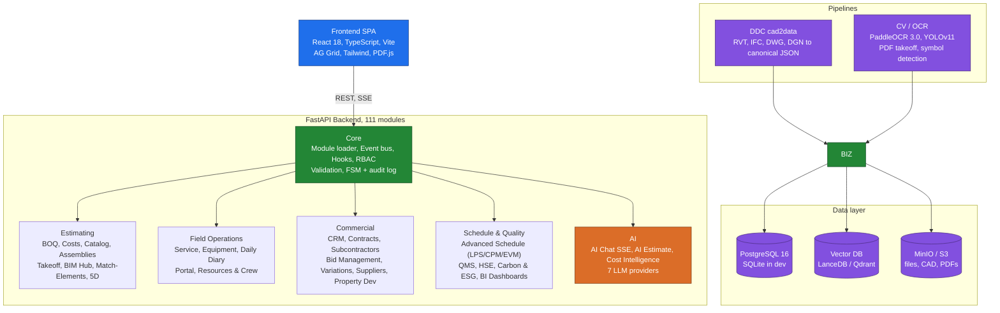

<div align="center">

# OpenConstructionERP

### The #1 open-source workspace for construction project management

**Like WordPress for construction companies** — pick modules from the marketplace, drop in your own, or replace ours with custom-built ones. Same plug-and-play model, but for BOQ, scheduling, cost control, BIM, and tendering.

Professional BOQ, 4D scheduling, 5D cost model, and tendering — all in one open-source platform.

[▶ Watch the 12-min walkthrough](https://www.youtube.com/watch?v=X06cIaroAeI) · [Demo](https://openconstructionerp.com) · [Documentation](https://openconstructionerp.com/docs) · [Discussions](https://t.me/datadrivenconstruction) · [Report Bug](https://github.com/datadrivenconstruction/OpenConstructionERP/issues)

<table>
<tr>
<td align="center" width="16.66%"><b>55K+</b><br/><sub>cost items</sub></td>
<td align="center" width="16.66%"><b>24</b><br/><sub>languages</sub></td>
<td align="center" width="16.66%"><b>48</b><br/><sub>regions</sub></td>
<td align="center" width="16.66%"><b>6</b><br/><sub>CAD formats</sub></td>
<td align="center" width="16.66%"><b>100+</b><br/><sub>modules</sub></td>
<td align="center" width="16.66%"><b>12</b><br/><sub>sections</sub></td>
</tr>
</table>

[](LICENSE)
[](https://github.com/datadrivenconstruction/OpenConstructionERP/releases/latest)
[](https://pypi.org/project/openconstructionerp/)
[)](https://pepy.tech/project/openconstructionerp)
[](https://github.com/datadrivenconstruction/OpenConstructionERP/stargazers)
<br/>
[](https://github.com/datadrivenconstruction/OpenConstructionERP/commits/main)


<video src="https://github.com/user-attachments/assets/20b9b585-93ac-4829-a3dc-0ede9ca9e2fc" controls width="800" playsinline>
  <a href="https://github.com/datadrivenconstruction/OpenConstructionERP/releases/download/v2.0.0/oce_full_demo.mp4">▶ 1-minute teaser (your browser can't inline this — click for full 12-min walkthrough)</a>
</video>

<sub><picture><source media="(prefers-color-scheme: dark)" srcset="docs/readme-icons/device-camera-video-dark.svg"></picture> <b>1-minute teaser above</b> · for the full 12-minute walkthrough → <a href="https://www.youtube.com/watch?v=X06cIaroAeI"><b>watch on YouTube</b></a> · onboarding → BoQ → BIM → DWG → PDF → AI → dashboard</sub>

*100% open source · 55,000+ cost items · AI estimation · 27 languages · 111 modules · Self-hosted*

</div>

---

<details open>
<summary><h2>Table of Contents</h2></summary>

<table width="100%">
<colgroup>
<col width="33%" />
<col width="34%" />
<col width="33%" />
</colgroup>
<tr>
<td valign="top">

<picture><source media="(prefers-color-scheme: dark)" srcset="docs/readme-icons/rocket-dark.svg"></picture> **Get Started**
- [Why OpenConstructionERP?](#why-openconstructionerp)
- [See It In Action](#see-it-in-action)
- [Quick Start](#quick-start)
- [Demo Accounts](#demo-accounts)

</td>
<td valign="top">

<picture><source media="(prefers-color-scheme: dark)" srcset="docs/readme-icons/credit-card-dark.svg"></picture> **Estimating & Costs**
- [Bill of Quantities](#-bill-of-quantities-boq-management)
- [Cost Databases & Catalog](#%EF%B8%8F-cost-databases--resource-catalog)
- [CAD/BIM Takeoff & AI](#%EF%B8%8F-cadbim-takeoff--ai-estimation)

</td>
<td valign="top">

<picture><source media="(prefers-color-scheme: dark)" srcset="docs/readme-icons/project-dark.svg"></picture> **Project Lifecycle**
- [4D Scheduling & 5D Cost](#-4d-scheduling--5d-cost-model)
- [Tendering, Risk & Reports](#-tendering-risk--reporting)
- [Requirements & Quality](#-requirements--quality-gates)
- [Property Development](#-property-development)

</td>
</tr>
<tr>
<td valign="top">

<picture><source media="(prefers-color-scheme: dark)" srcset="docs/readme-icons/globe-dark.svg"></picture> **Visualization & Coordination**
- [Geo Hub (3D Globe)](#-geo-hub-3d-globe)
- [Coordination Hub & Clash AI](#-coordination-hub--clash-ai)
- [PDF Markups & Annotations](#%EF%B8%8F-pdf-markups--annotations)

</td>
<td valign="top">

<picture><source media="(prefers-color-scheme: dark)" srcset="docs/readme-icons/shield-check-dark.svg"></picture> **Field & Quality**
- [Daily Diary & HSE](#-daily-diary--hse)
- [Punch List](#-punch-list)
- [Validation Engine](#%EF%B8%8F-validation--compliance-engine)

</td>
<td valign="top">

<picture><source media="(prefers-color-scheme: dark)" srcset="docs/readme-icons/gear-dark.svg"></picture> **Setup & Standards**
- [30+ Regional Standards](#-30-regional-standards)
- [Guided Onboarding](#-guided-onboarding)
- [All Key Features](#key-features)

</td>
</tr>
<tr>
<td valign="top">

<picture><source media="(prefers-color-scheme: dark)" srcset="docs/readme-icons/code-dark.svg"></picture> **Technical**
- [Tech Stack](#tech-stack)
- [Architecture](#architecture)
- [Security](#security)

</td>
<td valign="top">

<picture><source media="(prefers-color-scheme: dark)" srcset="docs/readme-icons/people-dark.svg"></picture> **Community**
- [Support the Project](#support-the-project)
- [AI Disclaimer](#ai-disclaimer)
- [Trademarks](#trademarks)

</td>
<td valign="top">

<picture><source media="(prefers-color-scheme: dark)" srcset="docs/readme-icons/law-dark.svg"></picture> **Legal & Privacy**
- [Export Control](#export-control)
- [License](#license)
- [Privacy and Terms](#privacy-and-terms)

</td>
</tr>
</table>

</details>

---

⭐ <b>If you want to see new updates and database versions and if you find our tools useful please give our repositories a star to see more similar applications for the construction industry.</b>
Star OpenConstructionERP on GitHub and be instantly notified of new releases.
<p align="center">
  <br>
  
  <br></br>
</p>

---

## <picture><source media="(prefers-color-scheme: dark)" srcset="docs/readme-icons/sparkle-fill-dark.svg"></picture> What's New in v5.2.7 — Project-detail widget grid

**v5.2.7** is a UI hotfix on top of v5.2.6. The 13 widgets on `/projects/:id` (RFI inbox, Change orders pulse, Daily diary, HSE incidents, Variations, Quality NCRs, Compliance, Schedule, Budget burn, Recent files, Photo strip, AI insights, Activity feed) were rendered as a **single tall column** since the original `ec5aec1e` widget customizer landed — never wrapped in a responsive grid, so users on desktop saw an awkward narrow stack on otherwise-wide screens. v5.2.7 wraps the block in `grid grid-cols-1 sm:grid-cols-2 lg:grid-cols-3 gap-4` with selective `lg:col-span-2` for widgets whose content (Schedule timeline, Budget burn history bars, Photo strip carousel) requires horizontal room and `sm:col-span-2 lg:col-span-3` for the full-width Activity feed. No backend changes; install is `pip install --upgrade openconstructionerp` with no migration needed.

---

## <picture><source media="(prefers-color-scheme: dark)" srcset="docs/readme-icons/sparkle-fill-dark.svg"></picture> What's New in v5.2.6 — Login fix (BUG-D02) + WCAG-AA contrast + Reporting renderer + Dashboard rollup + 1197 JA keys

**v5.2.6** is a quality-of-life wave on top of v5.2.5's install-crash fix. The headline change is **demo login works again from the manual form** — BUG-D01 had randomised the demo password per install for security, but everyone who typed the documented `DemoPass1234!` got 401. The new path short-circuits whitelisted demo emails through the password-free `demo_login` service when `SEED_DEMO=true` (default on community / self-host, off in production). The button + manual form + documented credential all work in one step now.

<table>
<tr>
<td width="50%" valign="top">

**<picture><source media="(prefers-color-scheme: dark)" srcset="docs/readme-icons/log-dark.svg"></picture> BUG-D02 — Demo login JustWorks**
Manual login form accepts the documented `DemoPass1234!` for the three seeded demo emails (`demo@`, `estimator@`, `manager@`) without checking the bcrypt hash. Production installs (`SEED_DEMO=false`) fall back to the normal verify path — no security regression. Whitelist sync test now covers router + service + seeder. 76 unit + 6 integration tests green.

**<picture><source media="(prefers-color-scheme: dark)" srcset="docs/readme-icons/checks-dark.svg"></picture> #216 — WCAG-AA contrast tokens**
Five semantic tokens (success / warning / error / info / blue-subtle) raised from sub-3:1 to 5.2–6.6:1 against their token backgrounds. Estimated **~700 of 863** axe-flagged contrast violations resolved at the design-system layer — no per-component patching. Apple Liquid button palette preserved; new `--oe-*-vivid` tokens keep saturated hues available for dots / status pips.

**<picture><source media="(prefers-color-scheme: dark)" srcset="docs/readme-icons/sparkle-dark.svg"></picture> #252 — Reporting renderer (built from scratch)**
`POST /reports/generate` previously stored a row but rendered nothing; the engine never existed. `ReportRenderer` (stdlib-only, no Jinja/WeasyPrint) now dispatches section types, escapes HTML, formats list-of-dicts as tables. New `GET /reports/{id}/content` returns rendered HTML. 7 new pytest cases + 38 existing reporting tests pass = 45/45.

</td>
<td width="50%" valign="top">

**<picture><source media="(prefers-color-scheme: dark)" srcset="docs/readme-icons/zap-dark.svg"></picture> #253 — ProjectWidgets → /dashboard/rollup/**
Project-detail page used to fan out 8 parallel widget requests on every paint. Now a single `/dashboard/rollup/?widgets=…` call feeds all 8 via a React context. Rollup endpoint grew from 10 → 18 known widget keys (additive — existing endpoints untouched). 5 widgets still standalone because their backend endpoints don't exist yet (graceful-null today). Mirrors VPS-502-mid-run mitigation memory note.

**<picture><source media="(prefers-color-scheme: dark)" srcset="docs/readme-icons/globe-dark.svg"></picture> #245 — JA locale: 1197 keys translated**
High-traffic surfaces covered: nav, sidebar admin grid, common buttons (Save / Cancel / Delete / …), validation messages, BOQ jargon (内訳明細書 / Position / Section / Resource / Assembly), project widgets, finance, procurement, match-elements. Acronyms (BOQ / IFC / BIM / GAEB / DIN) stay in Latin. ~529 long-tail keys (multi-sentence tooltips / onboarding paragraphs) deferred to a focused next pass.

**<picture><source media="(prefers-color-scheme: dark)" srcset="docs/readme-icons/broadcast-dark.svg"></picture> Latest alembic head**: `v3144` (unchanged from v5.2.5) — single-head invariant maintained.

</td>
</tr>
</table>

See the [latest release](https://github.com/datadrivenconstruction/OpenConstructionERP/releases/latest) and the [CHANGELOG](CHANGELOG.md) for the per-release breakdown.

---

## <picture><source media="(prefers-color-scheme: dark)" srcset="docs/readme-icons/log-dark.svg"></picture> What's New in v5.2.5 — International BOQ + Universal audit trail + Install-crash fix

The **v5.2.x** line graduates the platform to **116 modules** with three foundation epics from the Deep-Coordination initiative, plus **Epic I — International BOQ** for worldwide tender formats. **v5.2.5** specifically unblocks fresh `pip install` — the previous 4.5.0 wheel on PyPI crashed at startup because of a FastAPI 0.115.x regression on `@router.delete(status_code=204)` routes, and v5.2.5 pins `fastapi>=0.116`. Everyone stuck on 4.5.0 can now simply `pip install --upgrade openconstructionerp`.

<table>
<tr>
<td width="50%" valign="top">

**<picture><source media="(prefers-color-scheme: dark)" srcset="docs/readme-icons/bell-dark.svg"></picture> Epic B — Unified notifications dispatcher**
Single subscriber model that fans every cross-module event (RFI replies, snag assignments, approval requests, schedule shifts, …) out to in-app inbox + email recipients. Replaces 8 ad-hoc senders. SMTP path validated end-to-end (port 465 SSL, port 587 STARTTLS).

**<picture><source media="(prefers-color-scheme: dark)" srcset="docs/readme-icons/file-dark.svg"></picture> Epic C — File versioning unification**
`oe_file_version` is now the canonical table for every uploaded artefact: BIM models, BOQ imports, doc-template attachments, BCF 3.0 issue containers, RFI replies, drawing markups. **751 v1 rows backfilled** on the live demo VPS. Each upload carries a monotonic version + immutable parent ref — full audit history per file.

**<picture><source media="(prefers-color-scheme: dark)" srcset="docs/readme-icons/log-dark.svg"></picture> Epic H — Universal audit trail**
`oe_activity_log` records every state-changing action across all 116 modules (who · what · when · before/after). Visible in `/settings?tab=audit` and queryable per-record from every detail page. Compliance-ready (GDPR Art. 30, ISO 19650).

</td>
<td width="50%" valign="top">

**<picture><source media="(prefers-color-scheme: dark)" srcset="docs/readme-icons/globe-dark.svg"></picture> Epic I — International BOQ formats**
Native I/O for the four formats covering **~70% of the Tier-1 construction market**:
- **GAEB X81 / X83 / X84** (DACH) — hierarchical positions, GTU codes, FX-correct totals.
- **BC3 (FIEBDC-3)** (Spain) — capítulo/partida tree, mediciones, precios descompuestos.
- **NRM Excel** (UK) — work sections, NRM1 element codes, BCIS-compatible measurement rules.
- **MasterFormat Excel** (US) — division/section structure, Procore-compatible export.

New `/regional-exchange` page ties them together with one drag-and-drop import surface.

**<picture><source media="(prefers-color-scheme: dark)" srcset="docs/readme-icons/bug-dark.svg"></picture> v5.2.5 install-crash fix (#157)**
- `fastapi>=0.116.0,<1` pinned in `backend/pyproject.toml` so the buggy `Status code 204 must not have a response body` assertion never resolves again on a fresh install.
- Authenticated `/` now redirects to `/dashboard` (was `/projects` per #215 fix — restored canonical landing).
- W22: `deleteDiary` API helper added in the Daily Diary client.
- W25: `FinancePage.Payment.amount` widened to `string | number` + new `currency_code` field.

**<picture><source media="(prefers-color-scheme: dark)" srcset="docs/readme-icons/broadcast-dark.svg"></picture> Latest alembic head**: `v3144` (Wave 1 Deep-Coordination: notifications + file versioning + audit trail) · single-head invariant maintained across every wave.

</td>
</tr>
</table>

See the [latest release](https://github.com/datadrivenconstruction/OpenConstructionERP/releases/latest) and the [CHANGELOG](CHANGELOG.md) for the per-release breakdown.

---

## Why OpenConstructionERP?

Construction cost estimation software is expensive, closed-source, and locked to specific regions. OpenConstructionERP changes that.

| What you get | How it works |
|-------------|-------------|
| **Free forever** | AGPL-3.0 license. No subscriptions, no per-seat fees, no vendor lock-in. |
| **Your data, your server** | Self-hosted. Everything runs on your machine — nothing leaves your network. |
| **27 languages** | Full UI translation: English, German, French, Spanish, Portuguese, Russian, Chinese, Arabic, Hindi, Japanese, Korean, and 16 more. |
| **30+ regional standards** | DIN 276, NRM 1/2, CSI MasterFormat, GAEB, ГЭСН, DPGF, GB/T 50500, CPWD, ÖNORM, Birim Fiyat, Sekisan, SINAPI, and more. |
| **AI-powered** | Connect any LLM provider (Anthropic, OpenAI, Gemini, Mistral, Groq, DeepSeek) for smart estimation. |
| **55,000+ cost items** | CWICR database with 11 regional pricing databases (DACH, UK, US, France, Spain, Brazil, Russia, UAE, China, India, Canada). |

### How It Compares

<table width="100%">
<colgroup>
<col width="26%" />
<col width="20%" />
<col width="14%" />
<col width="13%" />
<col width="14%" />
<col width="13%" />
</colgroup>
<thead>
<tr>
<th align="left">Capability</th>
<th align="center">OpenConstructionERP</th>
<th align="center">Enterprise<br/>BIM</th>
<th align="center">CAD<br/>Takeoff</th>
<th align="center">Legacy<br/>Estimating</th>
<th align="center">PDF<br/>Markup</th>
</tr>
</thead>
<tbody>
<tr><td><b>License</b></td><td align="center">AGPL-3.0 (free)</td><td align="center">Proprietary</td><td align="center">Proprietary</td><td align="center">Proprietary</td><td align="center">Proprietary</td></tr>
<tr><td><b>Self-hosted / offline</b></td><td align="center">&#10004;</td><td align="center">&#10006;</td><td align="center">&#10006;</td><td align="center">&#9888; partial</td><td align="center">&#10006;</td></tr>
<tr><td><b>Price</b></td><td align="center"><b>Free forever</b></td><td align="center">~&#8364;500/mo</td><td align="center">~&#8364;300/mo</td><td align="center">~&#8364;200/mo</td><td align="center">~&#8364;30/mo</td></tr>
<tr><td><b>AI estimation</b></td><td align="center">&#10004; 7 LLM providers</td><td align="center">&#10006;</td><td align="center">&#10006;</td><td align="center">&#10006;</td><td align="center">&#10006;</td></tr>
<tr><td><b>UI languages</b></td><td align="center"><b>27</b></td><td align="center">5</td><td align="center">3</td><td align="center">2</td><td align="center">8</td></tr>
<tr><td><b>Regional standards</b></td><td align="center"><b>30+</b></td><td align="center">4</td><td align="center">3</td><td align="center">2</td><td align="center">&mdash;</td></tr>
<tr><td><b>BOQ editor</b></td><td align="center">&#10004;</td><td align="center">&#10004;</td><td align="center">&#10004;</td><td align="center">&#10004;</td><td align="center">&#10006;</td></tr>
<tr><td><b>CAD/BIM takeoff</b></td><td align="center">&#10004; RVT IFC DWG DGN</td><td align="center">&#10004;</td><td align="center">&#10004;</td><td align="center">&#10006;</td><td align="center">PDF only</td></tr>
<tr><td><b>4D/5D planning</b></td><td align="center">&#10004;</td><td align="center">&#10004;</td><td align="center">&#10006;</td><td align="center">&#10006;</td><td align="center">&#10006;</td></tr>
<tr><td><b>Cost database included</b></td><td align="center">&#10004; 55K+ rates</td><td align="center">&#10006; extra</td><td align="center">&#10006; extra</td><td align="center">&#10006; extra</td><td align="center">&#10006;</td></tr>
<tr><td><b>Resource catalog</b></td><td align="center">&#10004; 7K+ priced</td><td align="center">&#10006; extra</td><td align="center">&#10006;</td><td align="center">&#10006;</td><td align="center">&#10006;</td></tr>
<tr><td><b>Validation engine</b></td><td align="center">&#10004; 42 rules</td><td align="center">&#9888; limited</td><td align="center">&#10006;</td><td align="center">&#10006;</td><td align="center">&#10006;</td></tr>
<tr><td><b>REST API</b></td><td align="center">&#10004; full</td><td align="center">&#9888; limited</td><td align="center">&#10006;</td><td align="center">&#10006;</td><td align="center">&#10006;</td></tr>
<tr><td><b>Real-time collab</b></td><td align="center">&#10004; soft locks</td><td align="center">&#10004;</td><td align="center">&#10006;</td><td align="center">&#10006;</td><td align="center">&#10006;</td></tr>
<tr><td><b>Open data export</b></td><td align="center">&#10004; GAEB · XLSX · JSON</td><td align="center">&#9888; limited</td><td align="center">&#9888; limited</td><td align="center">&#9888; limited</td><td align="center">PDF only</td></tr>
<tr><td><b>IDS / COBie requirements</b></td><td align="center">&#10004; import + export</td><td align="center">&#10006;</td><td align="center">&#10006;</td><td align="center">&#10006;</td><td align="center">&#10006;</td></tr>
<tr><td><b>Property dev lifecycle</b></td><td align="center">&#10004; Lead → SPA → Handover</td><td align="center">&#10006;</td><td align="center">&#10006;</td><td align="center">&#10006;</td><td align="center">&#10006;</td></tr>
<tr><td><b>3D globe / geo-anchor</b></td><td align="center">&#10004; Cesium 3D Tiles</td><td align="center">&#9888; map only</td><td align="center">&#10006;</td><td align="center">&#10006;</td><td align="center">&#10006;</td></tr>
</tbody>
</table>

<sub>Comparison reflects typical category capabilities based on publicly available information as of Q1 2026. Pricing is approximate (per-seat, list price) and varies by vendor and region. OpenConstructionERP is an independent open-source project and is not affiliated with any commercial vendor in the categories above.</sub>

---

## See It In Action

Each block below is a short GIF cut from the full walkthrough above — same order as the video, so you can jump to whichever workflow matters most. Prefer one continuous video? **[▶ Watch the 12-minute walkthrough on YouTube](https://www.youtube.com/watch?v=X06cIaroAeI)**.

<table>
<tr>
<td align="center" width="50%">
<strong><picture><source media="(prefers-color-scheme: dark)" srcset="docs/readme-icons/person-dark.svg"></picture> 1 · Role-Based Onboarding</strong><br/>
<em>Sign in as Admin / Estimator / Manager — the wizard pre-selects the right 17 of 46 modules for your role</em><br/><br/>

</td>
<td align="center" width="50%">
<strong><picture><source media="(prefers-color-scheme: dark)" srcset="docs/readme-icons/globe-dark.svg"></picture> 2 · New Project, Any Region</strong><br/>
<em>Pick currency, classification standard, regional factor — live map & weather come along for free</em><br/><br/>

</td>
</tr>
<tr>
<td align="center">
<strong><picture><source media="(prefers-color-scheme: dark)" srcset="docs/readme-icons/zap-dark.svg"></picture> 3 · Build the Bill of Quantities</strong><br/>
<em>Keyboard-first editor, 55K+ priced items, AI cost finder & Smart AI — quality score updates live</em><br/><br/>

</td>
<td align="center">
<strong><picture><source media="(prefers-color-scheme: dark)" srcset="docs/readme-icons/tools-dark.svg"></picture> 4 · BIM → BOQ Bulk Link</strong><br/>
<em>Link 100 Revit walls → one BOQ line with aggregated area / volume / length — no IfcOpenShell</em><br/><br/>

</td>
</tr>
<tr>
<td align="center">
<strong><picture><source media="(prefers-color-scheme: dark)" srcset="docs/readme-icons/workflow-dark.svg"></picture> 5 · DWG Drawings & Layers</strong><br/>
<em>636 wall entities across 10 DWG layers — every one linkable to the BOQ, measured in place</em><br/><br/>

</td>
<td align="center">
<strong><picture><source media="(prefers-color-scheme: dark)" srcset="docs/readme-icons/pencil-dark.svg"></picture> 6 · PDF Takeoff</strong><br/>
<em>Drop a floorplan, measure distance / area / count, push the numbers straight into the BOQ</em><br/><br/>

</td>
</tr>
<tr>
<td align="center">
<strong><picture><source media="(prefers-color-scheme: dark)" srcset="docs/readme-icons/credit-card-dark.svg"></picture> 7 · Complete Estimate — $6.26M</strong><br/>
<em>Real Revit project → 215 positions, 88 sections, CWICR-priced, quality score 99</em><br/><br/>

</td>
<td align="center">
<strong><picture><source media="(prefers-color-scheme: dark)" srcset="docs/readme-icons/check-circle-fill-dark.svg"></picture> 8 · Every Module — BIM-Linked Tasks</strong><br/>
<em>Issues tied to exact model elements, tracked on a Kanban board alongside schedule, docs & requirements</em><br/><br/>

</td>
</tr>
<tr>
<td align="center">
<strong><picture><source media="(prefers-color-scheme: dark)" srcset="docs/readme-icons/graph-dark.svg"></picture> 9 · Data Explorer — Pivot → BOQ</strong><br/>
<em>CAD-BIM Explorer pivot becomes 10 BOQ positions in one click — charts, data bars & drill-down included</em><br/><br/>

</td>
<td align="center">
<strong><picture><source media="(prefers-color-scheme: dark)" srcset="docs/readme-icons/device-camera-dark.svg"></picture> 10 · AI Estimate from a Photo</strong><br/>
<em>Upload a construction photo → GPT-4o + YOLO return a scoped BOQ in seconds, confidence-scored</em><br/><br/>

</td>
</tr>
<tr>
<td align="center">
<strong><picture><source media="(prefers-color-scheme: dark)" srcset="docs/readme-icons/globe-dark.svg"></picture> 11 · Global Portfolio Dashboard</strong><br/>
<em>7 projects, 4 continents, $28.3M in active estimates — one workspace, one map</em><br/><br/>

</td>
<td align="center">
<strong><picture><source media="(prefers-color-scheme: dark)" srcset="docs/readme-icons/search-dark.svg"></picture> Bonus · Instant Search</strong><br/>
<em>Find any of 55K+ cost items across 11 regional databases by keyword, unit or classification</em><br/><br/>

</td>
</tr>
</table>

---

## Key Features

### <picture><source media="(prefers-color-scheme: dark)" srcset="docs/readme-icons/graph-dark.svg"></picture> Bill of Quantities (BOQ) Management


Build professional cost estimates with a powerful BOQ editor. The full lifecycle — from first sketch to final tender submission:

```
  Upload              Convert            Validate           Estimate           Tender
 ┌────────┐        ┌──────────┐       ┌───────────┐      ┌──────────┐      ┌──────────┐
 │PDF/CAD │───────▶│ Extract  │──────▶│ 42 rules  │─────▶│BOQ Editor│─────▶│ Bid Pkgs │
 │Photo   │        │quantities│       │ DIN/NRM/  │      │ + AI     │      │ Compare  │
 │Text    │        │ + AI     │       │ MasterFmt │      │ + Costs  │      │ Award    │
 └────────┘        └──────────┘       └───────────┘      └──────────┘      └──────────┘
                                                               │
                                                         ┌─────┴──────┐
                                                         │ 4D Schedule│
                                                         │ 5D Costs   │
                                                         │ Risk Reg.  │
                                                         │ Reports    │
                                                         └────────────┘
```

- **Hierarchical BOQ structure** — Sections, positions, sub-positions with drag-and-drop reordering
- **Inline editing** — Click any cell to edit. Tab between fields. Undo/redo with Ctrl+Z
- **Resources & assemblies** — Link labor, materials, equipment to each position. Build reusable cost recipes
- **Markups** — Overhead, profit, VAT, contingency — configure per project or use regional defaults
- **Automatic calculations** — Quantity × unit rate = total. Section subtotals. Grand total with markups
- **Validation** — 42 built-in rules check for missing quantities, zero prices, duplicate items, and compliance with DIN 276, NRM, MasterFormat
- **Export** — Download as Excel, CSV, PDF report, or GAEB XML (X83)

### <picture><source media="(prefers-color-scheme: dark)" srcset="docs/readme-icons/database-dark.svg"></picture> Cost Databases & Resource Catalog


Access the world's construction pricing data:

- **CWICR database** — 55,000+ cost items covering all major construction trades. Available in 9 languages with 11 regional price sets
- **Smart search** — Find items by description, code, or classification. AI-powered semantic search matches meaning, not just keywords ("concrete wall" finds "reinforced partition C30/37")
- **Resource catalog** — 7,000+ materials, equipment, labor rates, and operators. Build custom assemblies from catalog items
- **Regional pricing** — Automatic price adjustment based on project location. Compare rates across regions
- **Import your data** — Upload your own cost database from Excel, CSV, or connect via API

### <picture><source media="(prefers-color-scheme: dark)" srcset="docs/readme-icons/tools-dark.svg"></picture> CAD/BIM Takeoff & AI Estimation


Extract quantities from any source — drawings, models, text, or photos:

```
  Source              DDC cad2data         Canonical            Match              BOQ
 ┌────────┐         ┌──────────────┐    ┌──────────┐       ┌──────────┐      ┌──────────┐
 │.rvt    │         │ Element      │    │ Elements │       │ Classify │      │ Positions│
 │.ifc    │────────▶│ extraction   │───▶│ + Quants │──────▶│ (DIN/NRM)│─────▶│ + Linked │
 │.dwg    │         │ (no IFC OS)  │    │ + Props  │       │ + Costs  │      │ geometry │
 │.dgn    │         └──────────────┘    └──────────┘       └──────────┘      └──────────┘
 │.pdf    │                                                                         │
 │photo   │         ┌──────────────┐                                          ┌─────┴────┐
 │text    │────────▶│ CV / OCR / AI│──────────────────────────────────────▶  │ BIM Pick │
 └────────┘         │ (PaddleOCR + │                                          │ area/vol │
                    │  YOLOv11)    │                                          │ /length  │
                    └──────────────┘                                          └──────────┘
```


- **CAD/BIM takeoff** — Upload Revit (.rvt), IFC, AutoCAD (.dwg), or MicroStation (.dgn) files. DDC converters extract elements with volumes, areas, and lengths automatically
- **Interactive QTO** — Choose how to group extracted data: by Category, Type, Level, Family. Format-specific presets for Revit and IFC
- **Linked geometry preview** — Click the BIM link badge on any BOQ position to see a 3D preview of linked elements with interactive rotate/zoom/pan controls
- **BIM Quantity Picker** — Select quantities (area, volume, length) directly from linked BIM elements and apply them to BOQ positions. The source parameter name is shown next to the unit
- **DWG polyline measurement** — Click any polyline in the DWG viewer to instantly see area, perimeter, and individual segment lengths with on-canvas labels
- **PDF measurement** — Open construction drawings directly in the browser. Measure distances, areas, and count elements with calibrated scale
- **AI estimation** — Describe your project in plain text, upload a building photo, or paste a PDF — AI generates a complete BOQ with quantities and market rates
- **AI Cost Advisor** — Ask questions about pricing, materials, or estimation methodology. AI answers using your cost database as context
- **Cost matching** — After AI generates an estimate, match each item against your CWICR database to replace AI-guessed rates with real market prices

### <picture><source media="(prefers-color-scheme: dark)" srcset="docs/readme-icons/globe-dark.svg"></picture> Geo Hub (3D Globe)

Anchor every project on a real spherical earth — Cesium 3D Tiles 1.1 with live HUD and pin layers:

```
   Anchor              Globe                Mode               Deeplink            Fly-to
 ┌──────────┐       ┌──────────┐       ┌───────────┐       ┌────────────┐      ┌──────────┐
 │ Project  │       │ Cesium   │       │  Global   │       │ ?model=…   │      │ BIM scene│
 │ Plot     │──────▶│ 3D Tiles │──────▶│  Project  │──────▶│ ?plot=…    │─────▶│ PropDev  │
 │ CAD model│       │ live HUD │       │ Developm. │       │ ?dev_id=…  │      │ Daily Diary│
 └──────────┘       └──────────┘       └───────────┘       └────────────┘      └──────────┘
       ▲                  │                                                          │
       │                  ▼                                                          │
       │           ┌──────────────┐                                                  │
       └───────────│ Pin layers   │ ◀────── HSE · Punchlist · Daily Diary ◀──────────┘
                   └──────────────┘
```


- **Three-mode picker** — Global (planet-wide portfolio), Project (job-site scale), Development (plot-level masterplan)
- **Live HUD** — Cursor latitude / longitude, terrain altitude, dynamic scale bar, north arrow
- **Anchored Projects rail** — Floating collapsible overlay showing every geo-anchored project, click to fly-to
- **Deeplinks** — `?model=`, `?plot=`, `?dev_id=`, `?phase=`, `?block=` survive page reloads and shareable URLs
- **Pin layers** — HSE incidents, Punchlist items, Daily Diary entries plotted on the globe with category icons
- **"View on map" CTAs** — One click from BIM viewer, PropDev plot, Daily Diary entry, Project card → globe with that asset selected
- **DWG / PDF raster overlay** — Upload a site plan or floorplan, drag four corner pins onto the globe → the raster drapes over real terrain; polygon crop with vertex drag for cookie-cutter trimming
- **Canonical pipeline** — `POST /api/v1/geo-hub/from-canonical/{cad_import_id}` turns any DDC cad2data conversion into glTF 3D Tiles via pure-Python pygltflib (no commercial toolkit needed)

*Example: open a Berlin masterplan in Geo Hub, switch to Development mode, see all 12 plots colored by sale status, click one → reservation pipeline opens with that buyer pre-filtered.*

### <picture><source media="(prefers-color-scheme: dark)" srcset="docs/readme-icons/organization-dark.svg"></picture> Property Development

End-to-end real-estate developer workflow — from first lead to handover snags to warranty close-out:

```
   Lead          Reservation         SPA              Handover           Warranty
 ┌────────┐    ┌──────────┐     ┌──────────┐      ┌───────────┐      ┌──────────┐
 │ CRM    │───▶│ Hold +   │────▶│ Contract │─────▶│ Snags     │─────▶│ Defects  │
 │ inbox  │    │ deposit  │     │ + Escrow │      │ + Photos  │      │ liability│
 │ Broker │    │ schedule │     │ schedule │      │ + Sign-off│      │ + Promote│
 └────────┘    └──────────┘     └──────────┘      └───────────┘      └──────────┘
      │              │                │                  │                  │
      └──────────────┴────────────────┴──── Contact bridge (idempotent tags) ┘
                                              ▼
                                     ┌────────────────┐
                                     │ Price Matrix   │
                                     │ Phases · Blocks│
                                     │ House Types    │
                                     │ Brokers · Plots│
                                     └────────────────┘
```


- **Lead → Reservation → SPA → Handover → Warranty** — Full lifecycle FSM with auto-creation of ContractParty on SPA conversion, Payment Schedule state machine, idempotent stage transitions
- **Sub-entity tabs** — Phases · Blocks · Brokers · Price Matrix · Escrow — one screen for every dev operation, no page hops
- **House Type catalogue** — ISO 3166-1 picker covering 180+ countries plus Custom region; CountryCombobox + HouseTypeEditModal share the same backend taxonomy as catalog & costs
- **SnagsBlock per handover** — Photo upload, status (Open / Resolved / Disputed), one-click promote-to-warranty when a snag survives the defects-liability period
- **Contacts ↔ PropDev bridge** — Every Lead and Buyer is idempotently tagged as a Contact via `Contact.module_tags`, so CRM and PropDev stay in sync without duplicates
- **Price Matrix** — Per-phase × house-type × view-premium grid with currency-aware totals and bulk apply
- **Escrow** — Per-buyer payment schedule with milestone receipts and outstanding balance roll-up
- **Bootstrap to Accommodation** — One click on a development block creates a worker-camp / rental inventory in the [Accommodation](#-accommodation) module (1:1 plots → rooms, idempotent)

*Example: import a 240-unit residential masterplan, generate price matrix from house-type × view, push to globe, accept 18 reservations across 3 brokers, convert 11 to SPA, hand over 4, track 7 open snags in the warranty period — all in one app.*

### <picture><source media="(prefers-color-scheme: dark)" srcset="docs/readme-icons/home-dark.svg"></picture> Accommodation


One module for three lodging kinds — worker camps for site crews, rentals for staff, hotels for visiting consultants — with rooms, bookings and charges in a unified data model:

```
   PropDev block         Accommodation         Rooms              Bookings           Charges
 ┌──────────────┐      ┌──────────────┐    ┌────────────┐    ┌────────────┐    ┌────────────┐
 │ Plots #1..N  │──1▶──│ Worker camp  │───▶│ available  │───▶│ reserved   │───▶│ base rent  │
 │ (PropDev)    │ click│ Rental       │    │ occupied   │    │ checked_in │    │ extras     │
 │              │      │ Hotel        │    │ maintenance│    │ checked_out│    │ deposits   │
 └──────────────┘      └──────────────┘    │ blocked    │    │ cancelled  │    │ refunds    │
       ▲                     │             └────────────┘    └────────────┘    └────────────┘
       │                     ▼                                    ▲
       │              ┌──────────────┐                            │
       │              │ HR autobook  │ ◀──── lowest-labelled ─────┘
       │              │ (suggest+    │       available worker_camp room
       │              │  confirm)    │
       │              └──────────────┘
       │
   "Bootstrap to Accommodation" CTA
```

- **Three kinds, one module** — `worker_camp` · `rental` · `hotel`, with tab filter and per-kind capacity counters on every card
- **Rooms with status** — `available` · `occupied` · `maintenance` · `blocked`; 409 prevents booking into a blocked or maintenance room
- **Booking state machine** — `reserved → checked_in → checked_out` with `cancelled` from any non-final state; idempotent same-state updates; final states locked
- **Charges with Decimal precision** — Base rent, extras, deposits, refunds, all in the room's inherited currency (no hardcoded EUR)
- **PropDev bootstrap** — One click on a development block iterates its plots and creates rooms 1:1, idempotent (running twice creates nothing extra)
- **HR autobook (suggest-confirm)** — Pick an employee Contact → suggest the lowest-labelled available `worker_camp` room → human confirms with a real booking POST
- **BIM + Geo aware** — `bim_element_id` carries through from PropDev plots; cards with `geo_lat/geo_lon` get a "Geo" deeplink to the globe
- **IDOR-hardened** — Every helper returns 404 (never 403) on cross-tenant access; tested in `backend/tests/modules/accommodation/`

*Example: 240-plot worker camp on a remote site — bootstrap from the PropDev block, HR autobooks 187 crew members from the Contacts directory over three weeks, base-rent charges roll up to the project P&L automatically.*

### <picture><source media="(prefers-color-scheme: dark)" srcset="docs/readme-icons/comment-discussion-dark.svg"></picture> Floating Chat with the ERP Database

Bottom-right floating chat on every page — talks to the entire ERP database through 17 typed tools (projects, BOQ items, schedule, validation, risks, CWICR search, BIM elements, full semantic search):

```
  Any page          Floating button       Panel + 17 tools     Streamed
 ┌────────┐        ┌──────────────┐     ┌──────────────┐     ┌──────────┐
 │/projects│       │  bottom-right │     │ get_projects │     │ tool card│
 │/boq    │──FAB──▶│   ◯ Message  │────▶│ search_cwicr │────▶│ rendered │
 │/geo    │        │   (badge: 3) │     │ create_boq   │     │ in chat  │
 └────────┘        └──────────────┘     └──────────────┘     └──────────┘
```

- **Always-on** — Mounted in `AppLayout`, available on every route (Dashboard, BOQ, BIM, Geo, PropDev, Accommodation, all 111 modules)
- **Real ERP access** — Reads/writes through tools, not LLM guesswork: `get_all_projects`, `get_project_summary`, `get_boq_items`, `get_schedule`, `get_validation_results`, `get_risk_register`, `search_cwicr_database`, `get_cost_model`, `compare_projects`, `run_validation`, `create_boq_item`, `search_boq_positions`, `search_documents`, `search_tasks`, `search_risks`, `search_bim_elements`, `search_anything`
- **Streamed responses** — Tool-call cards (risk register table, BOQ summary, etc.) render inline as the model produces them
- **Provider-agnostic** — Anthropic / OpenAI / Gemini / Mistral / Groq / DeepSeek behind the same tool interface

### <picture><source media="(prefers-color-scheme: dark)" srcset="docs/readme-icons/heart-dark.svg"></picture> Coordination Hub & Clash AI

Multi-disciplinary BIM coordination with AI-assisted issue triage:

```
  Federation         Raw clashes        Smart Issues       AI Triage         BCF 3.0
 ┌──────────┐      ┌────────────┐     ┌────────────┐    ┌────────────┐    ┌──────────┐
 │ ARC ·STR │      │ thousands  │     │ clustered  │    │ severity   │    │ Solibri  │
 │ MEP ·HSE │─────▶│ raw pairs  │────▶│ by zone +  │───▶│ rework $   │───▶│ Navisw.  │
 │ models   │      │ + distance │     │ disciplines│    │ confidence │    │ BIMcollab│
 └──────────┘      └────────────┘     └────────────┘    └────────────┘    └──────────┘
                                            │                                  ▲
                                            ▼                                  │
                                    ┌─────────────┐                            │
                                    │ Smart Views │  IDS + COBie owner drops ──┘
                                    │ RFI · Tasks │
                                    │ Cost Impact │
                                    └─────────────┘
```


- **Coordination Hub** — Single dashboard fusing clashes, RFIs, submittals, action items per model federation
- **Smart Views v1** — Saved filters across the federation (e.g. "MEP-vs-STR clashes > 50mm in Level 03")
- **Clash Smart Issues** — Auto-group thousands of raw clash results into prioritized issue clusters by location + discipline pair
- **AI Triage** — LLM ranks new clashes by severity / rework cost / location criticality with confidence scores
- **Cost Impact rollup** — Per-issue rework estimate driven by your cost database, surfaced on the dashboard
- **BCF 3.0 / OpenCDE export** — Round-trip with Solibri, Navisworks, BIMcollab via the open BIM standard
- **BIM Requirements** — IDS (Information Delivery Specification) and COBie import / export for owner-side data drops

### <picture><source media="(prefers-color-scheme: dark)" srcset="docs/readme-icons/calendar-dark.svg"></picture> 4D Scheduling & 5D Cost Model

Plan your project timeline and track costs over time:

- **Gantt chart** — Visual project schedule with drag-and-drop activities, dependencies (FS/FF/SS/SF), and critical path highlighting
- **Auto-generate from BOQ** — Create schedule activities directly from your BOQ sections with cost-proportional durations
- **Earned Value Management** — Track SPI, CPI, EAC, and variance. S-curve visualization shows planned vs actual progress
- **Budget tracking** — Set baselines, compare snapshots, run what-if scenarios
- **Monte Carlo simulation** — Risk-adjusted schedule analysis with probability distributions

### <picture><source media="(prefers-color-scheme: dark)" srcset="docs/readme-icons/paste-dark.svg"></picture> Tendering, Risk & Reporting

Complete your estimation workflow:

```
   BOQ           Bid Package        Distribute         Compare           Award
 ┌────────┐    ┌────────────┐    ┌────────────┐    ┌────────────┐    ┌──────────┐
 │ priced │───▶│ subset +   │───▶│ Subs (mail │───▶│ side-by-   │───▶│ winner   │
 │ sections    │ instructions    │ + portal)  │    │ side mirror│    │ + change │
 │        │    │ + scope    │    │            │    │ + anomalies│    │   orders │
 └────────┘    └────────────┘    └────────────┘    └────────────┘    └──────────┘
                                                          │                │
                                                          ▼                ▼
                                                   ┌─────────────────────────┐
                                                   │ Reports · GAEB X83      │
                                                   │ Risk Register · EAC     │
                                                   └─────────────────────────┘
```


- **Tendering** — Create bid packages, distribute to subcontractors, collect and compare bids with side-by-side price mirror
- **Change orders** — Track scope changes with cost and schedule impact analysis
- **Risk register** — Probability × impact matrix, mitigation strategies, risk-adjusted contingency
- **Reports** — Generate professional PDF reports, Excel exports, GAEB XML. 12 built-in templates
- **Documents** — Centralized file management with version tracking and drag-and-drop upload

### <picture><source media="(prefers-color-scheme: dark)" srcset="docs/readme-icons/note-dark.svg"></picture> Requirements & Quality Gates

Track and validate construction requirements with the EAC (Entity-Attribute-Constraint) system:

- **EAC Triplets** — Capture requirements as structured data: Entity (wall), Attribute (fire_rating), Constraint (≥ F90)
- **4 Quality Gates** — Completeness → Consistency → Coverage → Compliance. Run sequentially to validate requirements
- **BOQ Traceability** — Link each requirement to BOQ positions for full traceability from spec to estimate
- **Bulk Import** — Import requirements from structured text (pipe-delimited format)
- **Categories** — Structural, fire safety, thermal, acoustic, waterproofing, electrical, mechanical, architectural

### <picture><source media="(prefers-color-scheme: dark)" srcset="docs/readme-icons/pencil-dark.svg"></picture> PDF Markups & Annotations

Annotate construction drawings and documents directly in the browser:

- **10 markup types** — Cloud, arrow, text, rectangle, highlight, polygon, distance, area, count, stamp
- **Custom stamps** — Approved, Rejected, For Review, Revised, Final + create your own with logo and date
- **Scale calibration** — Set real-world scale per page for accurate measurements
- **Markups List** — Table view of all annotations with filters, search, and CSV export
- **BOQ Integration** — Link measurements directly to BOQ positions (quantity = measured value)

### <picture><source media="(prefers-color-scheme: dark)" srcset="docs/readme-icons/check-circle-fill-dark.svg"></picture> Punch List

Track construction deficiencies from discovery to resolution:

- **5-stage workflow** — Open → In Progress → Resolved → Verified → Closed
- **Location pins** — Mark exact position on PDF drawings (x/y coordinates)
- **Priority levels** — Low, Medium, High, Critical with color coding
- **Photo attachments** — Upload photos of deficiencies from the field
- **Categories** — Structural, mechanical, electrical, architectural, fire safety, plumbing, finishing
- **PDF Export** — Generate punch list reports for stakeholder review
- **Verification control** — Different user must verify (not the resolver)

### <picture><source media="(prefers-color-scheme: dark)" srcset="docs/readme-icons/book-dark.svg"></picture> Daily Diary & HSE

Field-level reporting and safety tracking that holds up in court:

- **Daily Diary** — Weather-aware entries (auto-pulled from project geo-coordinates), crew on site, equipment used, deliveries, delays, photos
- **HSE Incidents** — Near-miss → first-aid → recordable → lost-time taxonomy with mandatory root-cause and corrective-action fields
- **OSHA-recordable flag** — Server-side default backing for compliant regulatory exports (300 / 300A / 301)
- **Photo capture with EXIF / GPS** — Field photos preserve location and timestamp metadata; magic-byte upload validation for defence-in-depth
- **Geo-anchored pins** — Daily Diary and HSE pins surface on the Geo Hub globe layer for portfolio-level safety dashboards

### <picture><source media="(prefers-color-scheme: dark)" srcset="docs/readme-icons/globe-dark.svg"></picture> 30+ Regional Standards

| Standard | Region | Format |
|----------|--------|--------|
| DIN 276 / ÖNORM / SIA | Germany / Austria / Switzerland | Excel, CSV |
| NRM 1/2 (RICS) | United Kingdom | Excel, CSV |
| CSI MasterFormat | United States / Canada | Excel, CSV |
| GAEB DA XML 3.3 | DACH region | XML |
| DPGF / DQE | France | Excel, CSV |
| ГЭСН / ФЕР | Russia / CIS | Excel, CSV |
| GB/T 50500 | China | Excel, CSV |
| CPWD / IS 1200 | India | Excel, CSV |
| Bayındırlık Birim Fiyat | Turkey | Excel, CSV |
| 積算基準 (Sekisan) | Japan | Excel, CSV |
| Computo Metrico / DEI | Italy | Excel, CSV |
| STABU / RAW | Netherlands | Excel, CSV |
| KNR / KNNR | Poland | Excel, CSV |
| 표준품셈 | South Korea | Excel, CSV |
| NS 3420 / AMA | Nordic countries | Excel, CSV |
| ÚRS / TSKP | Czech Republic / Slovakia | Excel, CSV |
| ACMM / ANZSMM | Australia / New Zealand | Excel, CSV |
| CSI / CIQS | Canada | Excel, CSV |
| FIDIC | UAE / GCC | Excel, CSV |
| PBC / Base de Precios | Spain | Excel, CSV |

### <picture><source media="(prefers-color-scheme: dark)" srcset="docs/readme-icons/shield-dark.svg"></picture> Validation & Compliance Engine

Ensure your estimates meet regulatory standards before submission:

- **42 built-in rules** across 13 rule sets — DIN 276, NRM, MasterFormat, GAEB, and universal BOQ quality checks
- **Real-time validation** — Run checks with Ctrl+Shift+V. Each position gets a pass/warning/error indicator
- **Quality score** — Overall BOQ quality percentage (0–100%) visible in the toolbar
- **Drill-down** — Click any finding to jump directly to the affected BOQ position and fix it
- **Custom rules** — Define project-specific validation rules via the rule builder or Python scripting

### <picture><source media="(prefers-color-scheme: dark)" srcset="docs/readme-icons/rocket-dark.svg"></picture> Guided Onboarding

Get productive in under 10 minutes:

1. **Choose language** — Select from 27 languages. The entire UI switches instantly
2. **Select region** — Determines default cost database, currency, and classification standard
3. **Load cost database** — One-click import of CWICR pricing data for your region (55,000+ items)
4. **Import resource catalog** — Materials, labor, equipment, and pre-built assemblies
5. **Configure AI** *(optional)* — Enter an API key from any supported LLM provider
6. **Create your first project** — Set name, region, standard, and start estimating

---

## Quick Start

> <picture><source media="(prefers-color-scheme: dark)" srcset="docs/readme-icons/eye-dark.svg"></picture> **Prefer to see it first?** [▶ Watch the 12-minute walkthrough on YouTube](https://www.youtube.com/watch?v=X06cIaroAeI) — onboarding → BoQ → BIM → DWG → PDF → AI → dashboard.

> **Requires Python 3.12+** (any path below). Check with `python --version`.

### Recommended: pip install (1 command, full app)

```bash
pip install --upgrade openconstructionerp
openestimate
```

That's it. Installs backend + pre-built React frontend in one wheel (~7.4 MB), opens your browser at **http://localhost:8080**, creates a SQLite database, and seeds the three demo accounts on first boot. No Docker, no Node.js, no extra services. [PyPI package](https://pypi.org/project/openconstructionerp/).

> **Ubuntu / Debian users:** on Ubuntu 23.04+ (including Ubuntu 26) and Debian 12+, `pip install` directly to the system Python fails with `error: externally-managed-environment` (PEP 668). Use a venv:
> ```bash
> sudo apt install -y python3.12 python3.12-venv
> python3.12 -m venv venv && source venv/bin/activate
> pip install --upgrade openconstructionerp
> ```
> Full Linux guide with system deps and troubleshooting: [docs/INSTALL_LINUX.md](docs/INSTALL_LINUX.md).

If something looks off, run `openestimate doctor` for a per-check OK/WARN/ERROR report.

### Alternative 1: One-line installer (auto-detects Docker / uv / pip)

```bash
# Linux / macOS
curl -fsSL https://raw.githubusercontent.com/datadrivenconstruction/OpenConstructionERP/main/scripts/install.sh | bash

# Windows (PowerShell)
irm https://raw.githubusercontent.com/datadrivenconstruction/OpenConstructionERP/main/scripts/install.ps1 | iex
```

Picks Docker if installed, otherwise uv, otherwise pip. Runs at **http://localhost:8080**.

### Alternative 2: Docker compose

```bash
git clone https://github.com/datadrivenconstruction/OpenConstructionERP.git
cd OpenConstructionERP
make quickstart
```

Open **http://localhost:8080** — builds everything in ~2 minutes.

### Alternative 3: Local development (clone + npm + uvicorn)

```bash
git clone https://github.com/datadrivenconstruction/OpenConstructionERP.git
cd OpenConstructionERP

# Install dependencies
pip install -e ./backend[server]
cd frontend && npm install && cd ..

# Start (Linux/macOS)
make dev

# Start (Windows — two terminals)
# Terminal 1: cd backend && uvicorn app.main:create_app --factory --reload --port 8000
# Terminal 2: cd frontend && npm run dev
```

Open **http://localhost:5173** — for hacking on the codebase. Requires Python 3.12+ and Node.js 20+.

### Demo Accounts

Three demo accounts are created automatically on first start. Each
password is **generated per installation** (via `secrets.token_urlsafe`)
and printed to the backend startup log so you see it immediately, e.g.:

```
[seed] Demo user created: demo@openestimator.io / xK7p_Q2nR8sT4uV6wX9yZ
[seed] Pre-set DEMO_USER_PASSWORD env to skip random generation
```

The same passwords are also persisted to
`~/.openestimator/.demo_credentials.json` (chmod 600) so you can recover
them later. To pin known passwords (e.g. for a team demo or CI), set the
env vars **before the first boot**:

- `DEMO_USER_PASSWORD` — admin (`demo@openestimator.io`)
- `DEMO_ESTIMATOR_PASSWORD` — estimator (`estimator@openestimator.io`)
- `DEMO_MANAGER_PASSWORD` — manager (`manager@openestimator.io`)

| Account | Email | Password | Role |
|---------|-------|----------|------|
| Admin | `demo@openestimator.io` | _see startup log or `.demo_credentials.json`_ | Full access |
| Estimator | `estimator@openestimator.io` | _see startup log or `.demo_credentials.json`_ | Estimator |
| Manager | `manager@openestimator.io` | _see startup log or `.demo_credentials.json`_ | Manager |

> Demo accounts include 5 pre-loaded projects from Berlin, London, New York, Paris, and Dubai with complete BOQs, schedules, and cost models.
>
> **Security note.** For any internet-exposed deployment, set the three
> `DEMO_*_PASSWORD` variables to strong, unique secrets, or disable demo
> accounts entirely with `DISABLE_DEMO_ACCOUNTS=1`. Do not reuse
> passwords from examples, screenshots, or earlier versions of this README.

---

## Tech Stack

| Layer | Technology | Purpose |
|-------|-----------|---------|
| Backend | Python 3.12+ / FastAPI | Async API, Pydantic v2 validation, modular architecture |
| Frontend | React 18 / TypeScript / Vite | SPA with code splitting, 27 language bundles |
| Database | PostgreSQL 16+ / SQLite (dev) | OLTP with JSON columns, zero-config SQLite for development |
| UI | Tailwind CSS / AG Grid | Professional data grid, responsive design, dark mode |
| AI | Any LLM via REST API | Anthropic, OpenAI, Gemini, Mistral, Groq, DeepSeek |
| Vector Search | LanceDB (embedded) / Qdrant | Semantic cost item search, 384d or 3072d embeddings |
| CAD/BIM | [DDC cad2data](https://github.com/datadrivenconstruction) | RVT, IFC, DWG, DGN → structured quantities |
| i18n | i18next + 27 language packs | Full RTL support (Arabic), locale-aware formatting |

## Architecture

### How the platform turns raw CAD/BIM into structured ERP data


OpenConstructionERP is built around **seven cooperating pipelines** that turn closed CAD/BIM files (RVT, IFC, DWG, DGN, PLN, TSK) into structured, queryable ERP data — without locking you into a proprietary stack. Every module in the platform plugs into one or more of these stages:

1. **Mining** — collect existing project data (CAD/BIM models, CDE drops, COBie deliverables) into a semi-structured pool. Handled by `cad`, `documents`, `bim_hub`, `file_search` modules + the **DDC cad2data** converters (RVT/IFC/DWG/DGN/PLN → canonical JSON).
2. **QTO Check & Quantity Take-off rules** — apply rule sets per discipline / family / type to extract quantities deterministically. Handled by `takeoff`, `requirements`, `validation`, and the rule editor in `match-elements`.
3. **BlackBox (company standard)** — codify your firm's classifications, formulas, unit factors and assembly recipes as a single canonical rule book (COBie / CFIHOS / SQL / Excel / Access). Handled by `costs`, `assemblies`, `catalog`, `cost_intelligence`.
4. **New project modeling** — apply the BlackBox to a fresh model: geometry → filtering → grouping → verification → BOQ. Handled by `boq`, `projects`, `match-elements`, `clash`.
5. **BlackBox mapping** — map a new project's raw element list onto the canonical rule book via vector + lexical + rule-based matchers. Handled by `match-elements` (7-stage pipeline) + AI Estimate.
6. **Project-specific data (4D/5D/6D)** — derive scheduling, cost, hours, ordering and environmental footprint per group. Handled by `scheduling`, `advanced_schedule`, `5d_planner`, `risk`, `carbon`, `hse`.
7. **Saving data & Machine Learning** — persist project history into the database, data lake and ML models so each new project starts further ahead. Handled by `analytics`, `bi_dashboards`, `ai_chat`, `cost_intelligence`, and the rule-learning loop in `clash` (Wave A4) and `match-elements`.

The right-hand side of the diagram is the **automatic data retrieval** layer that every UI surface (Dashboard, BOQ editor, /clash, /match-elements, /files, /scheduling) consumes: dashboards, calculations, reports, tables, charts, geometries, and ERP-ready exports — all driven from the same canonical store. The Machine-Learning column on the far right is where the platform progressively automates classification, parameterisation, recognition and marking, replacing manual steps (<picture><source media="(prefers-color-scheme: dark)" srcset="docs/readme-icons/tools-dark.svg"></picture>) with automatic steps (<picture><source media="(prefers-color-scheme: dark)" srcset="docs/readme-icons/zap-dark.svg"></picture>) over time.

This pipeline is the reason OpenConstructionERP can replace several commercial point-solutions with a single self-hosted stack — every module reads from and writes to the same canonical data layer.

### Technical stack



<details>
<summary>Plain-text version (for screen readers or non-Mermaid renderers)</summary>

```
┌──────────────────────────────────────────────────┐
│  Frontend (React SPA)                            │
│  TypeScript · Tailwind · AG Grid · PDF.js        │
└──────────────────┬───────────────────────────────┘
                   │ REST + SSE
┌──────────────────┴───────────────────────────────┐
│  Backend (FastAPI)                               │
│  111 auto-discovered modules · Plugin system     │
├──────────────────────────────────────────────────┤
│  BOQ · Costs · Schedule · 5D · Validation · AI   │
│  Takeoff · Tendering · Risk · Reports · Catalog  │
│  Requirements · Markups · Punch List · BIM Hub   │
│  PropDev · Geo Hub · Coordination · Clash AI     │
│  Accommodation · Floating Chat · 10 widgets      │
├──────────────────────────────────────────────────┤
│  Database (PostgreSQL / SQLite)                  │
│  Vector DB (LanceDB / Qdrant)                    │
│  CAD Converters (DDC cad2data)                   │
│  CV Pipeline (PaddleOCR + YOLOv11)               │
└──────────────────────────────────────────────────┘
```

</details>

---

## Support the Project

OpenConstructionERP is built and maintained by the community. If you find it useful:

- ⭐ **[Star this repo](https://github.com/datadrivenconstruction/OpenConstructionERP)** — helps others discover the project
- <picture><source media="(prefers-color-scheme: dark)" srcset="docs/readme-icons/comment-discussion-dark.svg"></picture> **[Join Discussions](https://t.me/datadrivenconstruction)** — ask questions, share ideas, help others
- <picture><source media="(prefers-color-scheme: dark)" srcset="docs/readme-icons/bug-dark.svg"></picture> **[Report issues](https://github.com/datadrivenconstruction/OpenConstructionERP/issues)** — help us improve
- <picture><source media="(prefers-color-scheme: dark)" srcset="docs/readme-icons/briefcase-dark.svg"></picture> **[Professional consulting](https://datadrivenconstruction.io/contact-support/)** — custom deployment, training, enterprise support

## Security

OpenConstructionERP includes security hardening for production deployments:
- Path traversal protection on all file download endpoints
- CORS wildcard blocking in production mode
- Bounded input validation on bulk price operations
- Generic error responses to prevent account enumeration
- Production startup checks for secrets, credentials, and database configuration

**Do not open public GitHub issues for security vulnerabilities.**
Report privately via
[GitHub Security Advisories](https://github.com/datadrivenconstruction/OpenConstructionERP/security/advisories/new)
or by email to
[info@datadrivenconstruction.io](mailto:info@datadrivenconstruction.io).
See [SECURITY.md](SECURITY.md) for the full coordinated-disclosure
policy, response timelines, supported versions, scope, and
regulatory-reporting obligations under EU Regulation 2024/2847
(Cyber Resilience Act).

## AI disclaimer

AI suggestions produced by this software are preliminary estimates. A
qualified construction-estimation professional must verify all
quantities, classifications, and costs before any contractual or
tender-submission use. See [NOTICE](NOTICE) and [TERMS.md](TERMS.md) §4.

## Trademarks

All product names, logos, and trademarks referenced in this repository
are property of their respective owners. Any comparative references to
commercial categories or products are made for fair comparative purposes
based on publicly available information. OpenConstructionERP is an
independent project and is not affiliated with, endorsed by, or sponsored
by any third-party trademark owners. Full attributions in [NOTICE](NOTICE).

## Export control

This software contains cryptographic functionality (bcrypt password
hashing, JWT signing). Export is classified under **US EAR 740.17** (TSU
mass-market exemption) and **EU Regulation 2021/821** (dual-use). The
Software is **not authorised** for download, use, or re-export to
jurisdictions subject to comprehensive OFAC sanctions. See [NOTICE](NOTICE)
for the full notice.

## License

**AGPL-3.0** — see [LICENSE](LICENSE). Third-party attributions in
[NOTICE](NOTICE).

You can freely use, modify, and distribute this software. If you modify
and deploy it as a service, AGPL §13 requires you to make the
corresponding source code available under the same licence.

For **commercial licensing** without AGPL obligations, see
[COMMERCIAL-LICENSE.md](COMMERCIAL-LICENSE.md) or contact
[info@datadrivenconstruction.io](mailto:info@datadrivenconstruction.io).

## Privacy and terms

- [PRIVACY.md](PRIVACY.md) — GDPR / UK DPA / CCPA / LGPD baseline
- [TERMS.md](TERMS.md) — terms of use for the hosted instance
- [COOKIES.md](COOKIES.md) — browser storage inventory
- [SECURITY.md](SECURITY.md) — responsible disclosure

---

<p align="left">
  <!-- Social Links -->
  <a href="https://x.com/datadrivenconst" target="_blank">
    
  </a>
  <a href="https://www.youtube.com/@datadrivenconstruction" target="_blank">
    
  </a>
  <a href="https://www.linkedin.com/company/78381569" target="_blank">
    
  </a>
  <a href="https://www.youtube.com/watch?v=X06cIaroAeI" target="_blank">
    
  </a>
</p>


<p align="left">

  <a href="https://datadrivenconstruction.io">
    
  </a>
  <br>
   <b>   Unlock the Power of Data in Construction</b>
   <br>
     <picture><source media="(prefers-color-scheme: dark)" srcset="docs/readme-icons/rocket-dark.svg"></picture> Move to full-cycle data management  where only unified <br /> structured data & processes remain and where  <picture><source media="(prefers-color-scheme: dark)" srcset="docs/readme-icons/unlock-dark.svg"></picture> your data is yours
</p>
